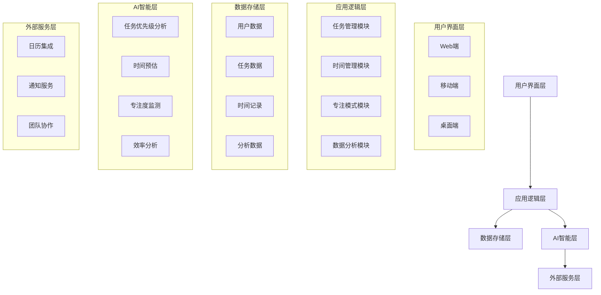

# 时间盒子项目开发手册

## 1. 项目概述

### 1.1 项目背景
基于马斯克的高效时间管理方法——时间盒（Timebox），本项目旨在开发一个AI驱动的时间管理系统，帮助开发者和团队提高工作效率，实现超越同行8倍的生产力提升。

### 1.2 项目目标
- 实现时间盒方法的数字化和智能化
- 帮助用户列出重要事项并设定时间边界
- 提供专注执行的环境和工具
- 基于科学原理优化时间管理流程
- 提升团队整体工作效率

### 1.3 目标用户
- 软件开发者和技术团队
- 项目管理人员
- 需要提高工作效率的专业人士
- 追求个人成长的知识工作者

## 2. 核心理论基础

### 2.1 时间盒方法的核心原理
时间盒方法是一种基于时间边界管理的高效工作方法，其核心思想是：

1. **明确边界**：为每个任务设定明确的开始和结束时间
2. **专注执行**：在设定的时间内专注完成任务
3. **优先级排序**：优先处理最重要的任务
4. **完成导向**：不追求完美，以完成任务为目标

### 2.2 科学依据

#### 2.2.1 二八法则（帕累托原理）
- 80%的成果来自20%的努力
- 每天识别并专注于最重要的3-5件事
- 避免陷入低价值任务的泥潭

#### 2.2.2 帕金森原则
- 工作会自动膨胀填满可用的时间
- 为任务设定明确的时间限制可以提高效率
- 时间压力会激发创造力和专注力

#### 2.2.3 大脑认知科学
- 大脑需要明确的边界来规划和执行任务
- 明确的时间边界可以减少决策疲劳
- 完成任务会释放多巴胺，增强动力

## 3. 系统架构设计

### 3.1 技术架构



### 3.2 技术选型

| 类别 | 技术 | 版本 | 选型理由 |
|------|------|------|----------|
| 前端框架 | React | 19.2.3 | 组件化开发，响应式设计 |
| 后端框架 | Node.js | 20.10.0 | 高效的异步处理能力 |
| 数据库 | MongoDB | 7.0+ | 灵活的数据模型，适合任务管理 |
| AI引擎 | TensorFlow.js | 4.10.0 | 浏览器端AI能力，实时分析 |
| 认证 | JWT | - | 无状态认证，便于扩展 |
| 部署 | Docker | 24.0.0 | 容器化部署，环境一致性 |

## 4. 核心功能模块

### 4.1 任务管理模块

#### 4.1.1 功能描述
- 任务创建和编辑
- 任务优先级设置
- 任务分类和标签
- 任务依赖关系管理
- 任务完成状态跟踪

#### 4.1.2 技术实现
```typescript
// 任务数据模型
interface Task {
  id: string;
  title: string;
  description: string;
  priority: 'high' | 'medium' | 'low';
  estimatedTime: number; // 预估时间（分钟）
  actualTime?: number; // 实际耗时（分钟）
  status: 'pending' | 'in_progress' | 'completed';
  tags: string[];
  dependencies: string[];
  createdAt: Date;
  updatedAt: Date;
}

// 任务管理服务
class TaskService {
  // 获取当日重要任务（3-5件）
  getImportantTasks(): Promise<Task[]> {
    // 实现逻辑
  }
  
  // 创建任务
  createTask(task: Omit<Task, 'id' | 'createdAt' | 'updatedAt'>): Promise<Task> {
    // 实现逻辑
  }
}
```

### 4.2 时间管理模块

#### 4.2.1 功能描述
- 时间盒创建和管理
- 时间边界设置
- 时间提醒和通知
- 时间使用分析
- 日历集成

#### 4.2.2 技术实现
```typescript
// 时间盒数据模型
interface Timebox {
  id: string;
  taskId: string;
  startTime: Date;
  endTime: Date;
  status: 'scheduled' | 'in_progress' | 'completed' | 'missed';
  notes?: string;
}

// 时间管理服务
class TimeboxService {
  // 创建时间盒
  createTimebox(taskId: string, startTime: Date, duration: number): Promise<Timebox> {
    // 实现逻辑
  }
  
  // 启动时间盒
  startTimebox(timeboxId: string): Promise<Timebox> {
    // 实现逻辑
  }
  
  // 结束时间盒
  endTimebox(timeboxId: string): Promise<Timebox> {
    // 实现逻辑
  }
}
```

### 4.3 专注模式模块

#### 4.3.1 功能描述
- 专注状态监测
- 干扰因素屏蔽
- 专注时间统计
- 番茄钟集成
- 专注环境设置

#### 4.3.2 技术实现
```typescript
// 专注会话数据模型
interface FocusSession {
  id: string;
  timeboxId: string;
  startTime: Date;
  endTime?: Date;
  duration: number; // 目标时长（分钟）
  actualDuration?: number; // 实际专注时长（分钟）
  distractions: number; // 干扰次数
  focusScore: number; // 专注度评分
}

// 专注模式服务
class FocusService {
  // 开始专注会话
  startFocusSession(timeboxId: string, duration: number): Promise<FocusSession> {
    // 实现逻辑
  }
  
  // 结束专注会话
  endFocusSession(sessionId: string, distractions: number): Promise<FocusSession> {
    // 实现逻辑
  }
}
```

### 4.4 数据分析模块

#### 4.4.1 功能描述
- 时间使用分析
- 效率趋势分析
- 任务完成率统计
- 专注度分析
- 个性化建议生成

#### 4.4.2 技术实现
```typescript
// 分析数据模型
interface Analysis {
  userId: string;
  period: 'day' | 'week' | 'month' | 'year';
  startDate: Date;
  endDate: Date;
  metrics: {
    totalTasks: number;
    completedTasks: number;
    completionRate: number;
    totalTimebox: number;
    averageFocusTime: number;
    efficiencyScore: number;
  };
  insights: string[];
  recommendations: string[];
}

// 数据分析服务
class AnalysisService {
  // 生成效率分析
  generateEfficiencyAnalysis(userId: string, period: 'day' | 'week' | 'month' | 'year'): Promise<Analysis> {
    // 实现逻辑
  }
}
```

### 4.5 AI智能层

#### 4.5.1 功能描述
- 任务优先级智能分析
- 时间预估智能算法
- 专注度监测和分析
- 个性化效率建议
- 团队协作优化

#### 4.5.2 技术实现
```typescript
// AI服务
class AIService {
  // 智能任务优先级分析
  analyzeTaskPriority(tasks: Task[]): Promise<Task[]> {
    // 实现逻辑
  }
  
  // 智能时间预估
  estimateTaskTime(task: Task): Promise<number> {
    // 实现逻辑
  }
  
  // 生成个性化建议
  generatePersonalizedRecommendations(userId: string): Promise<string[]> {
    // 实现逻辑
  }
}
```

## 5. 开发流程

### 5.1 时间盒开发方法

基于时间盒方法的核心原则，我们采用以下开发流程：

1. **每日规划**：
   - 每天开工前，列出当日最重要的3-5个开发任务
   - 为每个任务设定明确的时间边界
   - 按照优先级排序

2. **专注执行**：
   - 一到时间就开始执行任务
   - 避免多任务并行，保持专注
   - 遇到问题先记录，不追求完美解决方案

3. **时间管理**：
   - 严格遵守时间边界
   - 时间到了就停止当前任务
   - 记录实际耗时和完成情况

4. **每日回顾**：
   - 总结当日完成情况
   - 分析时间使用效率
   - 调整次日计划

### 5.2 迭代开发策略

- **短周期迭代**：采用2-3天的短迭代周期
- **增量交付**：每个迭代都交付可使用的功能
- **持续集成**：每天至少集成一次代码
- **快速反馈**：及时收集用户反馈并调整

## 6. 测试计划

### 6.1 测试策略

- **单元测试**：覆盖核心功能模块
- **集成测试**：验证模块间交互
- **端到端测试**：验证完整用户流程
- **性能测试**：确保系统响应迅速
- **用户测试**：收集真实用户反馈

### 6.2 测试用例

| 测试场景 | 测试步骤 | 预期结果 |
|---------|---------|----------|
| 任务创建 | 1. 创建新任务<br>2. 设置优先级<br>3. 保存任务 | 任务成功创建，显示在任务列表中 |
| 时间盒设置 | 1. 选择任务<br>2. 设置开始和结束时间<br>3. 保存时间盒 | 时间盒成功创建，显示在日历中 |
| 专注模式 | 1. 启动时间盒<br>2. 进入专注模式<br>3. 完成专注会话 | 专注模式正常启动，记录专注时间 |
| 数据分析 | 1. 完成多个任务<br>2. 查看分析报告<br>3. 检查建议 | 分析报告准确显示数据，建议合理 |

## 7. 部署和维护

### 7.1 部署策略

- **容器化部署**：使用Docker容器化应用
- **持续部署**：集成CI/CD流程
- **多环境部署**：开发、测试、生产环境分离
- **监控系统**：实时监控系统运行状态

### 7.2 维护计划

- **日常维护**：系统监控和日志分析
- **定期更新**：功能迭代和性能优化
- **用户支持**：建立用户反馈渠道
- **数据备份**：定期备份用户数据

## 8. 项目管理

### 8.1 团队结构

- **产品经理**：负责产品规划和需求管理
- **前端开发**：负责用户界面开发
- **后端开发**：负责核心逻辑和API开发
- **AI工程师**：负责智能算法开发
- **测试工程师**：负责质量保证
- **DevOps**：负责部署和运维

### 8.2 沟通机制

- **每日站会**：15分钟快速同步
- **周会**：总结一周进展和计划
- **代码审查**：确保代码质量
- **文档管理**：集中管理项目文档

### 8.3 风险管理

| 风险 | 影响 | 缓解措施 |
|------|------|----------|
| 需求变更 | 开发计划延迟 | 采用敏捷方法，灵活应对变更 |
| 技术难题 | 开发进度受阻 | 提前进行技术调研，预留缓冲时间 |
| 团队协作 | 沟通效率低下 | 建立明确的沟通机制，使用协作工具 |
| 用户接受度 | 产品 adoption 低 | 早期用户测试，持续收集反馈 |

## 9. 预期成果

### 9.1 产品成果

- 完整的时间盒子AI应用
- 详细的用户文档
- 开发和部署指南
- API文档

### 9.2 效率提升

- 个人工作效率提升3-5倍
- 团队协作效率提升2-3倍
- 项目交付时间缩短40%以上
- 开发质量显著提高

### 9.3 商业价值

- 提高团队生产力，降低开发成本
- 增强企业竞争力
- 为用户创造时间价值
- 建立高效工作文化

## 10. 结论

时间盒子项目基于马斯克的高效时间管理方法，结合AI技术，为开发团队提供了一种科学、有效的时间管理解决方案。通过明确的时间边界、专注的执行环境和智能的数据分析，我们相信这个项目能够帮助开发团队实现超越同行8倍的工作效率，为企业创造显著的商业价值。

让我们一起实践时间盒方法，像马斯克一样高效工作！