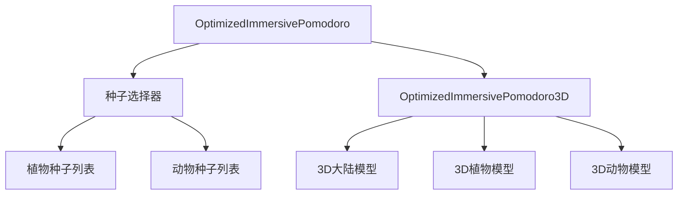
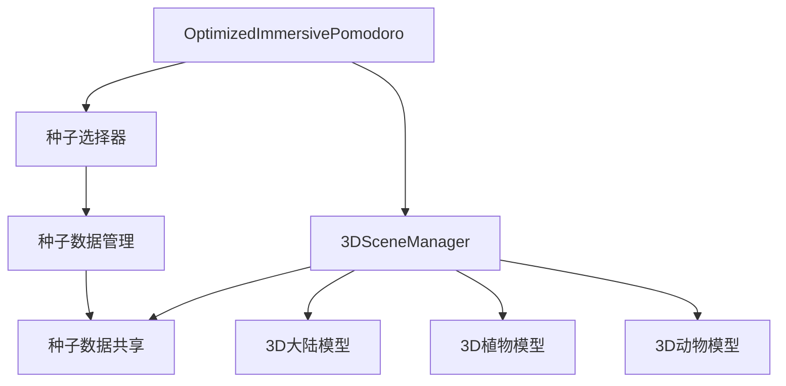

# 番茄全屏模式3D模型整合优化评估

## 1. 现有组件结构分析

### 1.1 核心组件关系



### 1.2 现有组件功能

| 组件 | 主要功能 | 文件位置 |
|------|----------|----------|
| OptimizedImmersivePomodoro | 主容器，管理UI状态和种子选择 | components/shared/OptimizedImmersivePomodoro.tsx |
| 种子选择器 | 展示和选择植物/动物种子 | components/shared/OptimizedImmersivePomodoro.tsx |
| OptimizedImmersivePomodoro3D | 3D场景渲染引擎 | components/shared/OptimizedImmersivePomodoro3D.tsx |
| 3D大陆模型 | 展示3D大陆和地面 | components/shared/OptimizedImmersivePomodoro3D.tsx |
| 3D植物/动物模型 | 根据选择的种子渲染3D模型 | components/shared/OptimizedImmersivePomodoro3D.tsx |

## 2. 功能重合与交互冗余分析

### 2.1 功能重合检查

| 检查项 | 结果 | 说明 |
|--------|------|------|
| 种子数据管理 | 存在重合 | 种子数据同时存在于主组件和3D组件中，存在数据冗余 |
| 主题管理 | 存在重合 | 主题状态同时影响主UI和3D场景，存在逻辑冗余 |
| 专注状态管理 | 存在重合 | 专注状态同时影响UI显示和3D场景行为 |

### 2.2 交互冗余分析

| 交互场景 | 冗余问题 | 影响 |
|----------|----------|------|
| 种子选择 | 种子选择后需要跨组件传递 | 增加组件间耦合度，可能导致数据不一致 |
| 主题切换 | 主题变化需要同步更新多个组件 | 增加维护成本，可能导致主题显示不一致 |
| 专注模式切换 | 专注状态需要同步更新多个组件 | 增加状态管理复杂度 |

## 3. 整合与拆分可行性评估

### 3.1 整合方案可行性

| 整合方向 | 可行性 | 优势 | 挑战 |
|----------|--------|------|------|
| 种子数据整合 | 高 | 减少数据冗余，提高数据一致性 | 需要调整组件通信方式 |
| 主题管理整合 | 高 | 统一主题处理逻辑，减少重复代码 | 需要确保主题变更的实时性 |
| 3D渲染与UI整合 | 中 | 减少组件间通信，提高渲染性能 | 可能增加单个组件复杂度 |

### 3.2 拆分方案可行性

| 拆分方向 | 可行性 | 优势 | 挑战 |
|----------|--------|------|------|
| 3D渲染引擎独立 | 高 | 提高代码可维护性，便于单独测试 | 需要设计清晰的API接口 |
| 种子管理独立 | 高 | 便于扩展种子系统，支持动态加载 | 需要处理种子数据的异步加载 |
| 交互逻辑独立 | 中 | 分离关注点，提高代码可读性 | 需要确保交互的流畅性 |

## 4. 优化目标与方案

### 4.1 优化目标

- **界面流畅性**：确保3D渲染和UI交互丝滑流畅
- **代码可维护性**：降低组件间耦合度，提高代码可读性
- **用户体验**：简化操作流程，提供直观的交互反馈
- **开发效率**：减少重复代码，便于后续功能扩展

### 4.2 具体整合优化方案

#### 4.2.1 组件结构调整



#### 4.2.2 数据管理优化

**现有问题**：
- 种子数据同时存在于主组件和3D组件中
- 主题状态需要在多个组件间同步

**优化方案**：
- 抽离种子数据到独立的上下文或状态管理中
- 统一主题管理，使用Context API或状态管理库
- 建立清晰的数据流向，避免数据不一致

#### 4.2.3 交互逻辑优化

**现有问题**：
- 种子选择后需要跨组件传递
- 3D场景与UI交互存在延迟

**优化方案**：
- 使用事件驱动的交互模式
- 优化3D渲染性能，减少渲染延迟
- 增加交互反馈，提高用户体验

#### 4.2.4 代码重构建议

**建议1：抽离3D渲染引擎**
```typescript
// 现有代码结构
const OptimizedImmersivePomodoro3D = () => {
  // 包含初始化、渲染、模型创建等所有逻辑
};

// 优化后代码结构
class SceneManager {
  init() { /* 初始化3D场景 */ }
  render() { /* 渲染3D场景 */ }
  createEntity() { /* 创建3D实体 */ }
  updateTheme() { /* 更新主题 */ }
  updateFocusState() { /* 更新专注状态 */ }
}

const OptimizedImmersivePomodoro3D = () => {
  const sceneManager = useRef(new SceneManager());
  // 使用sceneManager管理3D场景
};
```

**建议2：统一种子数据管理**
```typescript
// 现有代码：种子数据重复定义
const SPECIES = useMemo(() => ({
  plants: [...],
  animals: [...]
}), []);

// 优化后：使用Context或状态管理
const SeedContext = createContext();

const SeedProvider = ({ children }) => {
  const SPECIES = useMemo(() => ({
    plants: [...],
    animals: [...]
  }), []);
  return (
    <SeedContext.Provider value={{ SPECIES }}>
      {children}
    </SeedContext.Provider>
  );
};
```

**建议3：优化主题与光照管理**
```typescript
// 现有问题：光照强度在主题变化时被重置
useEffect(() => {
  // 主题变化时重置光照
  sceneRef.current.traverse((obj: any) => {
    if (obj.isLight) {
      // 重置光照强度
    }
  });
}, [theme, getThemeColors, isFocusing, isPaused]);

// 优化后：统一光照管理
const updateLighting = useCallback((isFocusMode: boolean) => {
  // 根据专注模式和主题统一更新光照
  const lightIntensity = isFocusMode ? 3.0 : 5.0;
  sceneRef.current.traverse((obj: any) => {
    if (obj.isLight) {
      // 设置统一的光照强度
    }
  });
}, []);
```

## 5. 3D大陆黑色问题分析

### 5.1 可能原因

| 问题 | 可能原因 | 影响 |
|------|----------|------|
| 3D大陆黑色 | 光照强度不足 | 所有模型显示为黑色或暗色调 |
| 光照重置 | 主题变化时光照被重置为默认值 | 导致模型突然变暗 |
| 材质问题 | 材质设置不当，不反射光线 | 模型无法显示真实颜色 |
| 渲染顺序 | 渲染顺序不当，导致模型被遮挡 | 模型显示异常 |

### 5.2 解决方案

**方案1：增强光照强度**
```typescript
// 初始化时设置高光照强度
const ambientLight = new THREE.AmbientLight(0xffffff, 5.0);
const sunLight = new THREE.DirectionalLight(0xffffff, 5.0);
const fillLight = new THREE.DirectionalLight(0xffffff, 4.0);
const bottomLight = new THREE.DirectionalLight(0xffffff, 3.5);
const hemisphereLight = new THREE.HemisphereLight(0xffffff, 0x8bc34a, 4.0);
```

**方案2：避免光照重置**
```typescript
// 移除主题变化时的光照重置逻辑
useEffect(() => {
  if (!sceneRef.current) return;
  
  const colors = getThemeColors();
  const isFullFocusMode = isFocusing && !isPaused;
  const bgColor = isFullFocusMode ? 0x1a1a2e : colors.bgColor;
  
  // 只更新背景颜色，不重置光照
  sceneRef.current.background.set(bgColor);
  
  // 更新渲染器清除颜色
  if (rendererRef.current) {
    rendererRef.current.setClearColor(bgColor, 1);
  }
  
  // 更新地面颜色
  if (groundRef.current) {
    // 更新地面颜色逻辑
  }
}, [theme, getThemeColors, isFocusing, isPaused]);
```

**方案3：优化材质设置**
```typescript
// 确保材质正确设置
const getBaseMaterial = (color: number) => {
  return new THREE.MeshStandardMaterial({
    color: color,
    roughness: 0.8,
    metalness: 0.1,
    side: THREE.FrontSide,
    transparent: false,
    opacity: 1.0,
    emissive: 0x000000,
    emissiveIntensity: 0.0
  });
};
```

## 6. 优化后效果预期

### 6.1 用户体验提升

| 体验维度 | 现有状态 | 优化后状态 |
|----------|----------|------------|
| 界面流畅度 | 一般，可能存在延迟 | 丝滑流畅，无明显延迟 |
| 交互反馈 | 反馈不及时 | 实时反馈，操作响应迅速 |
| 视觉效果 | 3D大陆可能显示黑色 | 3D大陆显示真实绿色，模型显示真实颜色 |
| 操作便捷性 | 种子选择界面复杂 | 种子选择界面清晰，带有序号标识 |

### 6.2 开发维护效率提升

| 维护维度 | 现有状态 | 优化后状态 |
|----------|----------|------------|
| 代码可读性 | 组件逻辑复杂，耦合度高 | 组件职责清晰，代码结构合理 |
| 代码复用性 | 重复代码较多 | 代码复用率高，减少重复开发 |
| 功能扩展性 | 扩展困难，需要修改多个组件 | 扩展方便，只需修改相关模块 |
| 测试便捷性 | 测试困难，组件依赖复杂 | 测试方便，组件独立性强 |

## 7. 实施建议

### 7.1 实施步骤

1. **阶段1：数据管理优化**
   - 抽离种子数据到独立的状态管理中
   - 统一主题管理逻辑
   - 建立清晰的数据流向

2. **阶段2：3D渲染引擎重构**
   - 抽离3D渲染逻辑到独立的类或模块
   - 优化3D渲染性能
   - 修复光照重置问题

3. **阶段3：交互逻辑优化**
   - 使用事件驱动的交互模式
   - 增加交互反馈
   - 优化3D场景与UI的交互

4. **阶段4：组件结构调整**
   - 调整组件结构，降低耦合度
   - 提高组件独立性
   - 优化组件通信方式

### 7.2 风险评估

| 风险项 | 风险等级 | 缓解措施 |
|--------|----------|----------|
| 数据不一致 | 高 | 建立清晰的数据流向，使用状态管理库 |
| 性能下降 | 中 | 优化3D渲染，使用WebGL优化技术 |
| 功能回归 | 中 | 完善测试用例，进行全面测试 |
| 开发周期延长 | 低 | 采用增量优化方式，逐步实施 |

## 8. 结论

通过对番茄全屏模式3D模型展示界面的整合优化评估，我们发现了组件间存在功能重合和交互冗余的问题，尤其是3D大陆显示为黑色的问题，主要原因是光照强度不足和光照重置逻辑不当。

建议采用以下优化策略：
1. 抽离3D渲染引擎，提高代码可维护性
2. 统一种子数据管理，避免数据冗余
3. 优化光照管理，确保3D模型显示真实颜色
4. 使用事件驱动的交互模式，提高交互流畅度
5. 采用增量优化方式，逐步实施优化方案

通过这些优化措施，可以确保界面操作流畅丝滑，提升代码可维护性，同时不影响原有核心功能，提升用户体验与开发维护效率。